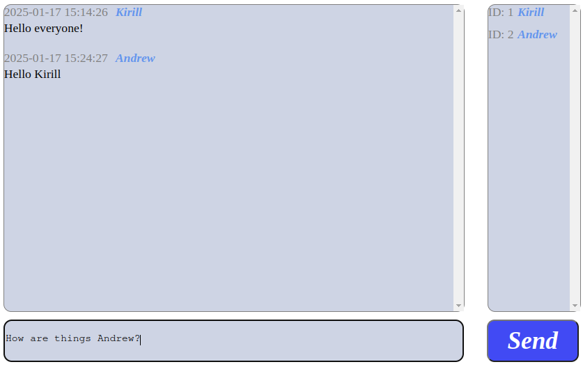

<h1 align="center">Group chat</h1>

----
## Stack
Java, Spring Boot, Maven, JDBC, Hibernate, SQL.
____
## Sort description
Functionality of this Spring Boot app includes:
<li>registration/authentication;</li>
<li>messages listing;</li>
<li>messages creation and sending.</li>

____
# UI
## Login/registration form
<p align="center">
</p>

## Overall look
<p align="center">
</p>
<p align="center">
</p>

___
## API
___
### GET /init
<details>
<summary>JSON Response</summary> 

{\
&emsp;'result': true\
}
</details> 

### GET /message
<details>
<summary>JSON Response</summary> 

[\
&emsp;{\
&emsp;&emsp;'text': "Hello",\
&emsp;&emsp;'username': "Kirill",\
&emsp;&emsp;'datetime': "2023-02-22 13:13:11"\
&emsp;},\
&emsp;...\
]
</details> 

### POST /message
<details>
<summary>JSON Response</summary> 

{\
&emsp;'result': true\
}
</details> 

### POST /auth
<details>
<summary>JSON Response</summary> 

{\
&emsp;'result': true\
}
</details> 

### GET /user
<details>
<summary>JSON Response</summary> 

[\
&emsp;{\
&emsp;&emsp;'id': "4",\
&emsp;&emsp;'name': "Kirill",\
&emsp;},\
&emsp;...\
]
</details>

___
## Hiw to build
You would need:
<li>installed MySQL (8.0);</li>
<li>establised DB connention, config file - application.yaml.</li>

```
server:
  port: 8080

spring:
  datasource:
    username: root
    password: password
    url: jdbc:mysql://localhost:3306/mychat?useSSL=false&requireSSL=false&allowPublicKeyRetrieval=true
  jpa:
    properties:
      hibernate:
        dialect: org.hibernate.dialect.MySQL8Dialect
```
____
